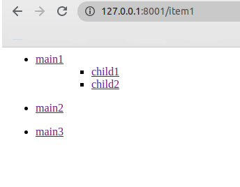
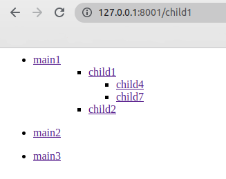

# uptrader_test

## Инструменты
+ Python
+ Django

## Запуск проекта
+ Клонирование репозитория
```bash
git clone git@github.com:AntonKralin/uptrader_test.git
```
+ Перейдите в папку и создайте и активируйте виртуальное окружение
```bash
cd uptrader_test
python3 -m venv venv
source venv/bin/activate
```
+ Установите необходимые зависимости
```bash
pip install -r requirements.txt
```
+ Выполните миграцию
```bash
python3 manage.py migrate
```
+ Тестовое наполнение базы данных
```bash
python3 manage.py loaddata fixture/menu.json
python3 manage.py loaddata fixture/menuitem.json
```
+ Запустите приложение
```bash
python3 manage.py runsever 8001
```

## Примеры




## База данных
Menu - таблица главноего меню
- title - название меню
- link - адресс меню

MenuItem - таблица пунктов меню
- title - название пункта меню
- link - адресс пункта меню
- menu - указание на Menu к которому относится пункт
- parent - родительский пункт меню